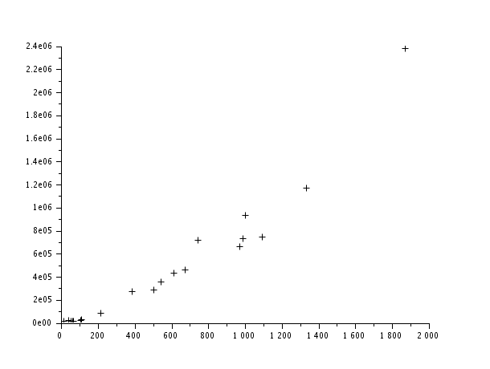

# QUESTION 7

## 1)

requête pour avoir V : 
```SQL
select num_reg, count(num_form)
from REGION natural join DEPARTEMENT natural join ETABLISSEMENT natural join FORMATION natural join VOEUX natural join STATS
where session=2022 group by num_reg;
```

moyenne de V: mean(V) sur scilab, ce qui nous domme  543

mediane de V: on prends la 11eme valeur dans la liste triée : 544

mode de V : 1871

requête pour avoir E :

```SQL
select num_reg, sum(nb_voe_pp)
from REGION natural join DEPARTEMENT natural join ETABLISSEMENT natural join VOEUX natural join FORMATION natural join STATS
where session=2022 group by num_reg; 
```

requête pour avoir le nuage de point : `plot2d1(X,Y,-1)`


on peut y voir une correlation linéaire entre V et E


V=[989; 1336;970;506;386;1871;1094;674;744;544;1003;614;62;111;108;54;215;67;39;14;2];

Vv=gsort(V);

N = length(V)
moy = mean(V)

E=[727834;  1170069;   662770;   287462;   268465;  2376267;   743411;   459430;   719372;   358231; 929747; 434649; 14574; 26224; 20544; 12469; 82451; 11038; 22970; 17149; 190];

moyE=mean(E)

plot2d1(V,E,-1)

VarV=mean((V-mean(V)).^2)
VarE=mean((E-mean(E)).^2)

sqrt(VarV*VarE)

mean(V.*E)
cov=mean(V.*E)-mean(V)*mean(E)
cor=cov/sqrt(VarV*VarE)